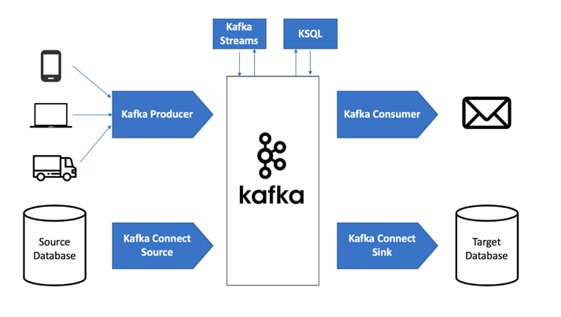

# kafka-tutorial-demo


* Set Up doc: [click here](02%20Workshop%20on%20Kakfa%20-%20CLI%20Tools,%20Simple%20Producer%20&%20Consumer%20using%20Java.pdf)

### Notes:

* Article on Kafka Producer/Consumer/Kafka Connect/ Kafka Streams and KSQl
  * https://medium.com/@stephane.maarek/the-kafka-api-battle-producer-vs-consumer-vs-kafka-connect-vs-kafka-streams-vs-ksql-ef584274c1e

> 

* Create kafka producer and Consumer API
  * https://boottechnologies-ci.medium.com/realtime-web-notification-using-apache-kafka-spring-websocket-and-angular-67bf00982989
  
* Suriya NUS Sample Kafka Project: https://github.com/suriarasai/ARTS2021/tree/main/kafkademo/src/main/java/sg/edu/iss/kafkademo

### Run Kafka Cluster on Local:

* Kafka Handy Commands to run on Local Mahcine 
  Refer Link: https://kafka.apache.org/quickstart
  * Create Topic: 
  ```text
  $ bin/kafka-topics.sh --create --topic quickstart-events --bootstrap-server localhost:9092
  ```
  * Write Text to Topic: Producer Console Client. However, we can also use create a separate producer client to publish messages
  ```text
  $ bin/kafka-console-producer.sh --topic quickstart-events --bootstrap-server localhost:9092
  ```
  
  * Consume Message to Topic: 
  ```text
  $ bin/kafka-console-consumer.sh --topic quickstart-events --from-beginning --bootstrap-server localhost:9092
  ```

### Connect Kafka with Elastic Search using Connect
https://speakerdeck.com/rmoff/building-streaming-data-pipelines-with-elasticsearch-apache-kafka-and-ksql?slide=23


****************************************End

----

#### Below is to set up kafka cluster using docker-compose file, unfortunately the cluster is too unstable
* Useful links: https://github.com/bitnami/bitnami-docker-kafka#how-to-use-this-image
Still keeping the files here to try later.

* https://engineering.bitnami.com/articles/create-a-pub-sub-messaging-cluster-with-bitnami-s-kafka-and-zookeeper-containers.html

* Open Kafka:
  ```kafka-topics.sh --create --zookeeper zookeeper:2181 --replication-factor 3 --partitions 3 --topic mytopic```

* Consumer:
  ```kafka-console-consumer.sh --bootstrap-server zookeeper:2181 --topic mytopic --from-beginning```

* Error: zookeeper is not a recognized option
  * https://stackoverflow.com/questions/53428903/zookeeper-is-not-a-recognized-option-when-executing-kafka-console-consumer-sh


* Kafdrop for viewing UI
  * https://towardsdatascience.com/kafdrop-e869e5490d62

Another effort to run the kafka ui- does not work.
docker run -p 8081:8081 -e KAFKA_CLUSTERS_0_NAME=local -e KAFKA_CLUSTERS_0_BOOTSTRAPSERVERS=kafka:9092 -e KAFKA_CLUSTERS_0_ZOOKEEPER=zookeeper:2181 -d provectuslabs/kafka-ui:latest


#### Cmnd which worked
Create the Kafka Topic

* Create Topic in on Container/Broker
  ```docker exec -it kafka-tutorial-demo_kafka_1 kafka-topics.sh --create --zookeeper zookeeper:2181 --replication-factor 3 --partitions 3 --topic ui-test-logs```

* Create Consumer in other Container/Broker
  ```docker exec -it kafka-tutorial-demo_kafka2_1 kafka-console-consumer.sh --bootstrap-server kafka:9092 --topic ui-test-logs --from-beginning```

* Write in producer:
  ```docker exec -it kafka-tutorial-demo_kafka_1 kafka-console-producer.sh --topic ui-test-logs --bootstrap-server kafka:9092```
 